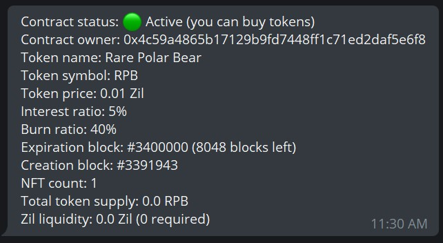

# Walk-through for Lenders

CollectiveNFT is a smart contract that let you earn interest by lending Zil. 
Simply put, you send money to the contract and after a specified amount of 
time, you can claim your money with interest. There is no middle man here. 
The smart contract ensures that everything goes as it should.

Contract owners lock up an NFT or more as collateral. If they don't pay you 
with interest at the end of the contract period, they'll lose the collateral. 
Interest rate and contract period are set by the contract owners as well. 

It's important to assess the value of locked-up NFTs before engaging in a 
contract. Remember that the contract owner can lose the NFTs and keep your 
money. **As a rule of thumb, never let the contract owner access more monetary 
value than the cumulative value of all locked-up NFTs.**

---

## Get Started with CollectiveNFT

### 1. Find a good contract

Higher interest rate doesn't necessarily mean a better contract. You should 
consider other factors as well. NFT owners can lure you into a bad contract 
by setting a high interest rate. Therefore, it's very important to manually 
check and assess the value of the locked-up NFTs. The collateral for the 
loan (i.e. the value of locked-up NFTs) should never be less than the loan; 
otherwise, it would be profitable for the contract owner to lose the NFTs 
and get away with all the loan.

Expiration block is another important term. Always check it and make sure 
it's logical. Each block in Zilliqa network corresponds to 45 seconds to 4 
minutes of time. Contract owner can set the expiration block to let's say 
200 years later. Don't engage in such a contract unless you've found the 
potion of eternal life.

Each contract has an address associated with it. You need to get that 
address from the contract owner to be able to interact with the contract.
You can use [CollectiveNFT Telegram Bot](https://t.me/collective_nft_bot) 
to 
interact with a CollectiveNFT smart contract. The process is almost the same
with both.

The first thing you probably need is to check the contract terms. Simply, 
enter the contract address to get an overview.

You can check the list of locked-up NFTs as well.

### 2. Buy tokens (i.e. give some loan)

Assuming you've assessed the contract terms and NFTs value entirely, you may 
lend Zil to the contract owner. In order to keep track of everyone's share, 
the contract mints tokens corresponding to the value of Zil you lend. The 
token price is set by the contract owner and isn't of any importance. You'll 
always get tokens equivalent to the loan amount you send to the contract.

Follow the procedure to buy tokens. Once bought, these tokens are yours, and 
only yours. You can keep them or transfer them. You can even sell these 
tokens via other avenues (like your own website).

You can buy as many tokens as you want while the contract is in active status. 
The contract owner may close the contract when he's got enough loan.

### 3. Wait for expiration

When a contract is closed, you can't buy any more tokens. You may wait until 
the preset expiration block is near.

### 4. Claim your funds with interest

When the expiration block is passed, you can claim your original loan with
interest (if the contract status is 'expired').

---

## QA

* ### Can I lose money?
  #### Yes, you may lose your money if you don't research beforehand!

* ### What happens at the end of the contract period?
  #### Scenario #1: If there is enough Zil liquidity in the contract, everything ends well. Token owners get their Zil + interest, and all tokens are burnt. Contract is terminated, and contract owner can unlock his NFTs.
  #### Scenario #2: If there isn't enough Zil liquidity in the contract to pay back token owners, contract owner loses his NFTs. Minted tokens will represent the locked NFTs and can still be traded.

