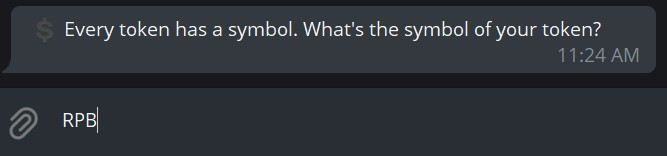

# Walk-through for NFT Owners

CollectiveNFT contract makes it possible to lock up your NFTs as collateral 
and get loans from other people. You can set the contract terms such as the 
interest rate, and the contract period.

At the end of the contract period, you must pay back all lenders with interest 
(which can be set to 0% of course); otherwise you'll lose all your locked-up 
NFTs.

---

## Get Started with CollectiveNFT

### 1. Create a new contract

You can use [CollectiveNFT Telegram Bot](https://t.me/collective_nft_bot) 
to create 
and manage a CollectiveNFT smart contract. The process is almost the same with 
both. There are a few parameters you need to set in order to have a working 
contract:

#### *Expiration block*

You must pay back your loans with interest at a specified time. In blockchain 
world, time is usually measured by blocks. Each block in Zilliqa network can 
take 45 seconds to 4 minutes to be mined. In the dApp, each block is estimated 
to be one minute, and you can just select a date.

In the Telegram bot, you can enter the block number yourself, so you have more 
control. Current block is always shown.

#### *Interest rate*

Interest rate is the percentage of interest lenders will get when the
contract period is over. You may set it to zero for no interest (i.e. you 
pay back only the original loan. You can't have decimals for the interest 
rate. Therefore, `5` is acceptable but `1.5` isn't.

#### *Burn rate*

Lenders may need their money back before the end of the contract. You can 
let them (or not let them) to burn their tokens and get their money back 
before the end of the contract period. If you allow them to burn tokens (by 
leaving some Zil liquidity in the contract), you can set a burn rate. 
Burn rate is the percentage of ZIL the contract refunds when burning
tokens before the end of contract period (if you allow it).
For example, if you set it to `70`, the contract will send back 70% of ZIL to
token burners (instead of a full refund). If you set it to zero, burning 
tokens lead to no refund at all.

#### *Name*

In order to keep records, the contract mint fungible tokens for lenders 
corresponding to the loan amount. You should set a name for your token to 
be distinguishable from other tokens. For example, ZilPay's token name is 
simply `ZilPay Wallet`.

#### *Symbol*

Every token has a symbol too. You may choose a symbol for your token. For 
example, ZilPay Wallet's token symbol is `ZLP`.

#### *Price*

Finally, you need to set a price for your token. It doesn't matter much. The 
real value of your token comes from the value of the locked-up NFTs. This is 
just a rate for minting the token.

Lenders can buy as many tokens as the want. There is virtually no limit for 
minting new tokens. However, if they buy more tokens than the equivalent value 
of the locked-up NFTs, you may choose to take the money, and lose the NFTs!

By creating a contract, you pay a small amount of gas fee. After a short while, 
you'll get the contract address. Keep it in a safe place. This is the 
address you should give to the lenders to get loans.

### 2. Send your NFTs to the contract

Now that you have a contract address, you can send your NFTs to it. The 
contract itself has no access to your NFTs, so you must send your NFTs to the 
contract yourself. You may use the wallet or the dApp you had bought the NFTs 
with.

Note that you can't mint new NFTs directly for the contract. You can only 
transfer owned NFTs. In technical language, you can use one of these 
transitions: `Transfer` or `TransferFrom` in a *"NonFungibleToken"* contract.

When you send an NFT to the contract, it gets locked up, and the contract 
becomes active. You may send several NFTs to the same contract to increase 
the collateral.

### 3. Sell tokens (i.e. get loan)

Give your contract address to interested lenders to get some loan. You can 
check the contract status for more info.

### 4. Close the contract

Closing the contract means you've had enough loan. A closed contract won't 
mint new tokens, which means lenders can't buy any more tokens.

**Closing the contract is important specially if your interest rate is high. 
If you don't close the contract after getting enough loan, you can get into 
trouble. For example, somebody may buy tokens only a few blocks before the 
expiration block, just to profit!**

### 5. Enjoy your loan

You may move the funds from the contract to your own account and put them 
into good use. 

### 6. Get ready to pay back

You can check your contract status to see the required amount of Zil for 
a graceful expiration. A graceful expiration means that the contract has 
enough liquidity to pay back all lenders, and you can unlock your NFT. 
Add funds to the contract to reach the required amount.

**Make sure that contract's liquidity is equal to the required amount. Even a 
shortage of 0.000000000001 Zil will lead to losing your NFT!**

**Don't leave more liquidity than necessary in the contract. When the contract 
expires, you'll lose access to them.**

### 7. Unlock your NFTs

Assuming a graceful expiration, you may now transfer your NFTs to your 
account.

---

## QA

* ### What if I got no loan?
  #### You can cancel the contract and unlock your NFTs.

* ### What if I got a huge amount of loan unexpectedly?
  #### If the amount is much higher than the cumulative value of the locked-up NFTs, good! You can take it and get away! You'll lose your NFT though, but you profit.

* ### How many NFTs can be locked up in a single contract?
  #### Two to the power of 128 which practically means there is no limit. However, beware of gas fees!

* ### What happens at the end of the contract period?
  #### Scenario #1: If there is enough Zil liquidity in the contract, everything ends well. Token owners get their Zil + interest, and all tokens are burnt. Contract is terminated, and contract owner can unlock his NFTs.
  #### Scenario #2: If there isn't enough Zil liquidity in the contract to pay back token owners, contract owner loses his NFTs. Minted tokens will represent the locked NFTs and can still be traded.

* ### What if my NFT has an ApprovedSpender?
  #### When you transfer your NFT to this contract, ApprovedSpender is automatically deleted. Please note that if your NFT contract is not the standard contract, this may not happen.
